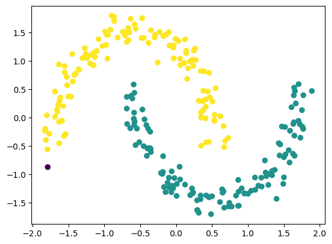

# 🔍 DBSCAN Clustering


An unsupervised machine learning project that applies **DBSCAN clustering** on two different datasets and analyzes cluster quality using **silhouette score** and visual inspection.

---

## 📌 Project Overview

This project demonstrates the use of **DBSCAN (Density-Based Spatial Clustering of Applications with Noise)** on two different datasets. DBSCAN groups data points based on density, allowing it to identify arbitrarily shaped clusters and detect noise points.

Both datasets are clustered separately, and their results are compared using **silhouette scores** and clustering visualizations.

---

## 📁 Project Structure

- DBSCAN_clustering.ipynb — Main notebook implementing DBSCAN on two datasets  
- output_1.png — Clustering result for Dataset 1  
- output_2.png — Clustering result for Dataset 2  
- README.md — Project documentation  

---

## ⚙️ Technologies Used

- Python  
- NumPy  
- Pandas  
- Matplotlib  
- scikit-learn  
- Jupyter Notebook  

---

## 🧠 Machine Learning Model

- Algorithm: DBSCAN  
- Learning Type: Unsupervised Learning  
- Distance Metric: Euclidean Distance  
- Key Parameters: eps, min_samples  

---

## 📊 Clustering Results

### Dataset 1 Output


- Silhouette Score: 0.3799  
- Indicates moderate cluster separation  
- DBSCAN successfully identifies dense regions  

---

### Dataset 2 Output


- Silhouette Score: 0.1098  
- Indicates weaker cluster separation  
- Highlights DBSCAN’s sensitivity to data distribution and density  

---

## 📈 Silhouette Score Comparison

- Dataset 1 shows better-defined clusters  
- Dataset 2 has overlapping or less dense clusters  
- Demonstrates how DBSCAN performance varies with data structure  

---

## ▶️ How to Run

1. Clone the repository  
```text
git clone https://github.com/btboilerplate/DBSCAN_Clustering.git  
```

2. Install required libraries  
```text
pip install numpy pandas matplotlib scikit-learn  
```

3. Open DBSCAN_clustering.ipynb and run all cells sequentially  

---

## 🧪 Key Observations

- DBSCAN can detect non-linear and arbitrarily shaped clusters  
- Performance depends heavily on eps and min_samples  
- Silhouette score helps quantify clustering quality  
- DBSCAN does not require specifying the number of clusters  

---

## 🚀 Future Improvements

- Tune eps and min_samples automatically  
- Compare DBSCAN with K-Means and Hierarchical Clustering  
- Apply to real-world noisy datasets  
- Visualize noise points explicitly  

---
